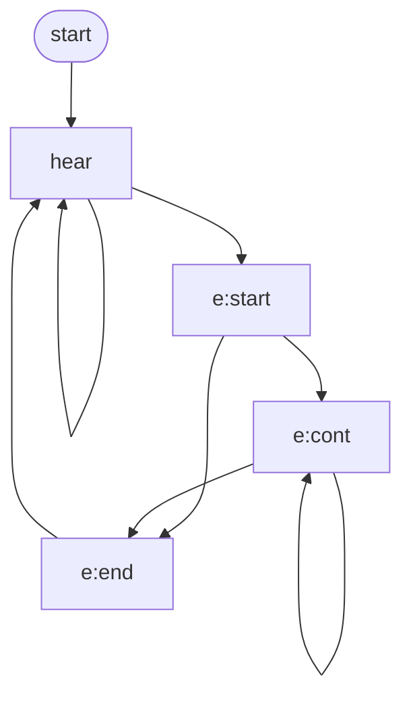

# AudioId - Sound identification

## Overview

...


## Events

The application outputs to `stdout` one line per event, with tab-separated fields:

```
time	type	label	duration
```

Each event consists of:

* `time` - the timestamp for the event (seconds).
* `type` - the type of event, one of:
  * `hear`: a status update outside of a recognized event giving the currently hypothesized label.  This is the only event that may have a different label to the previous event.  
  * `e:start`: a recognized audio event has definitely started.
  * `e:cont`: a duration update for a continuing audio event.
  * `e:end`: a recognized audio event has completed with a final duration.
* `label` - the text label for the recognized audio matched from the data.
* `duration` - the current duration the label has been recognized (seconds).

The event `type` will follow these state transitions:



## Example use

Learning from an audio file accompanied with labels (tab-separated start/end/label):

```bash
./audioid --visualize --labels data/on-single-off-on-flush-off.txt data/on-single-off-on-flush-off.wav --learn --write-state state.ini
```

Testing from existing labels:

```bash
./audioid --visualize --state state.ini data/on-single-off-on-flush-off.wav --labels data/on-single-off-on-flush-off.txt
```

Example events file (`events.ini`):

```ini
[grinder]
minduration = 3.0

[pump]
minduration = 3.0
afterevent = "grinder"
withininterval = 15.0
```

Label live audio:

```bash
./audioid --events events.ini --state state.ini
```

## Command-line options

...


## Configuration files

...`state.ini` / `events.ini`...


## Notes

There is an [example Node wrapper, including WebSocket server and client](js).

The code makes use of these libraries:

* [miniaudio](https://miniaud.io/) - audio capture (and playback) library 
* [minfft](https://github.com/aimukhin/minfft) - minimalistic Fast Fourier Transform library
